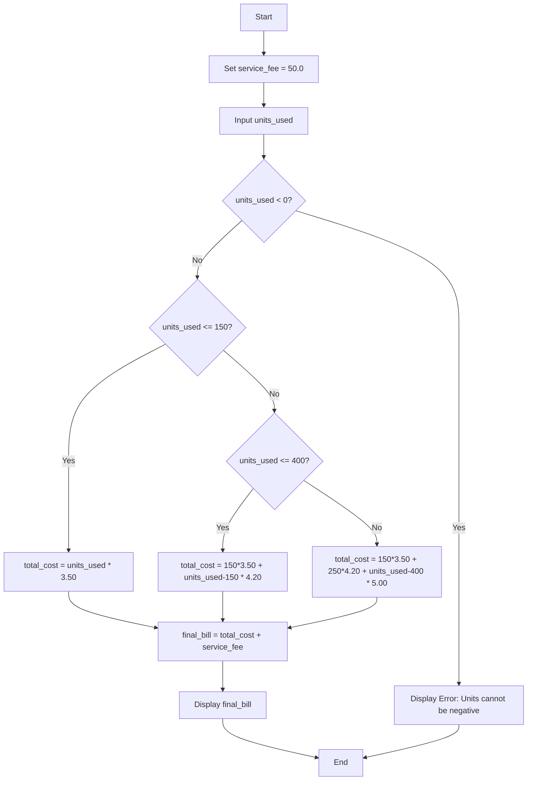

# Electricity Bill Calculation Flowchart

```mermaid
graph TD
    A[Start] --> B[Set service_fee = 50.0]
    B --> C[Input units_used]
    C --> D{units_used < 0?}
    D -- Yes --> E[Display Error: Units cannot be negative]
    D -- No --> F{units_used <= 150?}
    
    F -- Yes --> G[total_cost = units_used * 3.50]
    F -- No --> H{units_used <= 400?}
    
    H -- Yes --> I[total_cost = 150*3.50 + units_used-150 * 4.20]
    H -- No --> J[total_cost = 150*3.50 + 250*4.20 + units_used-400 * 5.00]
    
    G --> K[final_bill = total_cost + service_fee]
    I --> K
    J --> K
    
    K --> L[Display final_bill]
    L --> M[End]
    E --> M
```
