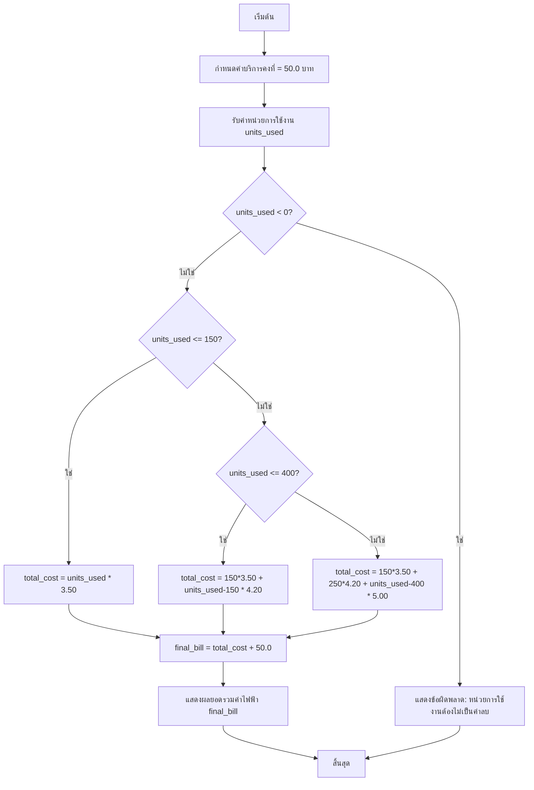

# ผังงานการคำนวณค่าไฟฟ้า (Flowchart)

```mermaid
graph TD
    A[เริ่มต้น] --> B[กำหนดค่าบริการคงที่ = 50.0 บาท]
    B --> C[รับค่าหน่วยการใช้งาน units_used]
    C --> D{units_used < 0?}
    D -- ใช่ --> E[แสดงข้อผิดพลาด: หน่วยการใช้งานต้องไม่เป็นค่าลบ]
    D -- ไม่ใช่ --> F{units_used <= 150?}
    
    F -- ใช่ --> G[total_cost = units_used * 3.50]
    F -- ไม่ใช่ --> H{units_used <= 400?}
    
    H -- ใช่ --> I[total_cost = 150*3.50 + units_used-150 * 4.20]
    H -- ไม่ใช่ --> J[total_cost = 150*3.50 + 250*4.20 + units_used-400 * 5.00]
    
    G --> K[final_bill = total_cost + 50.0]
    I --> K
    J --> K
    
    K --> L[แสดงผลยอดรวมค่าไฟฟ้า final_bill]
    L --> M[สิ้นสุด]
    E --> M
```
